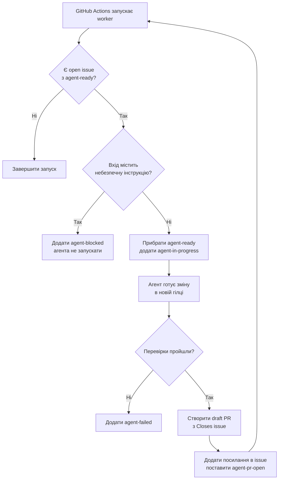

# Цикл GitHub issue-worker

Ключові моменти:

- шкідливий issue зупиняється до checkout і запуску моделі;
- для безпечного issue worker одразу прибирає `agent-ready`, тому наступний
  запуск не може взяти ту саму задачу повторно.
