# Process map

Full SDLC diagram with gates and owners.

```mermaid
flowchart TD
    A0[map-architecture<br/>Step 0 — codebase survey<br/>→ docs/architecture-map.md] --> A1

    A1[interview<br/>ideation suite<br/>→ idea-brief.md] --> B

    B[write-prd<br/>→ PRD.md] --> B2
    B2[clarify-prd<br/>ambiguity sweep<br/>→ PRD.md tightened]

    B2 --> C
    C{🚪 GATE<br/>PRD ready?}
    C -->|yes| D

    D[architecture-design<br/>Arc42 + C4 L1/L2 + target_surfaces<br/>→ sad.md + adr/] --> D2
    D2[complete-sequence-diagrams<br/>§6 flows, surface-gated UI legs<br/>→ sad.md §6]

    D2 --> E[generate-data-model<br/>→ data-model.md + staged migrations/]
    E --> F[api-forge<br/>→ contracts/ openapi.yaml + events/cli/public-api + api-sync-report]
    F --> G[break-tasks<br/>→ tasks/_epic.md + tracker.md + tasks.json]
    G --> H[plan-tests<br/>→ test-plan.md]
    H --> I[implement-tasks<br/>TDD engine, promotes migrations<br/>→ committed code + tests]

    I --> J
    J{🚪 GATE<br/>review-feature<br/>PASS?}
    J -->|CHANGES REQUESTED| I
    J -->|PASS| K

    K[ship-feature<br/>→ CHANGELOG + PR body<br/>roadmap → Shipped]

    classDef gate fill:#fde68a,stroke:#b45309,color:#000;
    classDef step0 fill:#dbeafe,stroke:#1d4ed8,color:#000;
    classDef util fill:#f3f4f6,stroke:#6b7280,color:#000;
    class C,J gate;
    class A0 step0;
    class A1 util;
```

**Ad-hoc utilities** (run any time, no stage order):
- `classify-size` → `.size` (XS/S/M/L/XL)
- `decide-adr` → `adr/NNNN-*.md` (blast-radius gate, Proposed→Accepted)
- `roadmap` → `docs/roadmap.md` (Now/Next/Later/Shipped)
- `fix-term` → `CONTEXT.md` glossary / `CONTEXT-MAP.md`

## Gates

| # | Gate skill | Input required | What it blocks |
|---|------------|---------------|----------------|
| write-prd | idea-brief | `idea-brief.md` must exist | PRD without framing becomes guess-work |
| architecture-design | PRD | `PRD.md` signed off | Architecture without requirements drifts |
| decide-adr | PRD + SAD | `PRD.md` + `sad.md` present | ADR without context lacks blast-radius evidence |
| review-feature 🚪 | implemented diff | Full diff against target_surfaces AC | Code ships without structured end-to-end AC trace |
| ship-feature 🚪 | review PASS | `_review/review-<date>.md` verdict = PASS | Changelog + PR created before quality is confirmed |

## Who writes what

- **PM**: idea-brief (drives ideation), PRD (co-author), KPIs.
- **Tech Lead**: PRD (co-author), sequence diagrams, decide-adr review + DoR sign-off, break-tasks, plan-tests, review-feature, ship-feature.
- **Architect**: architecture-design, complete-sequence-diagrams, sad.md.
- **Backend Lead**: generate-data-model, api-forge, staged migrations, decide-adr (often).
- **QA / Backend**: plan-tests, implement-tasks (test tier), review-feature (quality stage).
- **Release manager**: ship-feature (CHANGELOG, PR body, roadmap Shipped entry).

## Step 0 — map-architecture

`map-architecture` is always first. It scans the codebase once and writes `docs/architecture-map.md` at the repo root. Every later skill reads this file instead of re-scanning. For greenfield repos it also scaffolds an initial `tasks.json`. The §Frontend/UI foundation section lets downstream UI work reuse the existing design system rather than reinventing it.
