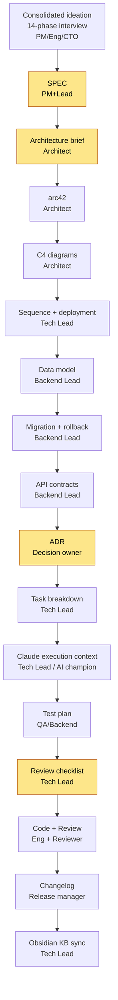

# Process map

Full SDLC diagram with gates and owners.

## Gates

| # | Gate | What it blocks |
|---|------|----------------|
| 03 | SPEC | Without SPEC there is no WHAT/WHY contract — architecture will guess |
| 04 | Architecture brief | Without the brief, full arc42 is written blindly |
| 11 | ADR | Without recorded decisions, downstream tasks have holes |
| 16 | Review checklist | Without a checklist, review is uneven |

## Who writes what

- **PM**: idea-brief (drives ideation), SPEC (co-author), KPIs.
- **Tech Lead**: SPEC (co-author), seq, ADR review (Stage 11) + DoR sign-off (new Stage 13 responsibility), task-breakdown, claude-context, review-checklist, KB note. Joins ideation at multi-perspective review.
- **Architect**: architecture-brief, arc42, C4, sequence.
- **Backend Lead**: data-model, migration, API contracts, ADR (often).
- **QA**: test plan.
- **Release manager**: CHANGELOG, release notes.
