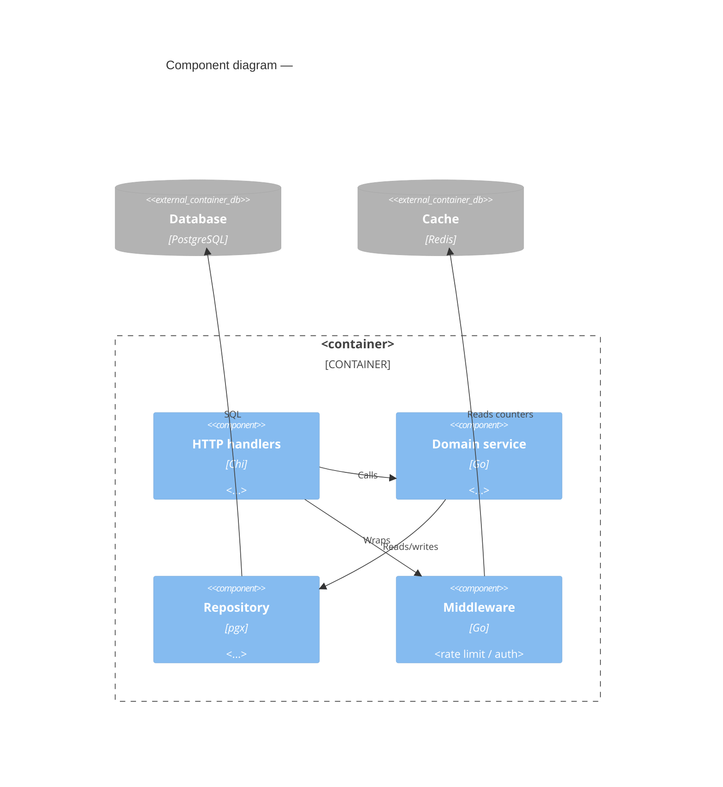

# C4 — Component (<container>)

<!-- Stage 06 → see SDLC/plugin/skills/draw-c4/SKILL.md -->

```mermaid
C4Component
    title Component diagram — <container name>

    Container_Boundary(api, "<container>") {
        Component(handler, "HTTP handlers", "Chi", "<...>")
        Component(svc, "Domain service", "Go", "<...>")
        Component(repo, "Repository", "pgx", "<...>")
        Component(mw, "Middleware", "Go", "<rate limit / auth>")
    }

    ContainerDb_Ext(db, "Database", "PostgreSQL")
    ContainerDb_Ext(cache, "Cache", "Redis")

    Rel(handler, mw, "Wraps")
    Rel(handler, svc, "Calls")
    Rel(svc, repo, "Reads/writes")
    Rel(repo, db, "SQL")
    Rel(mw, cache, "Reads counters")
```
