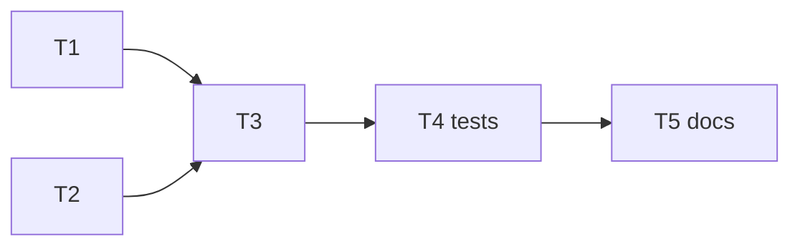

# Task breakdown — <feature>

<!-- Stage 13 → see SDLC/plugin/skills/break-tasks/SKILL.md -->

## Dependency graph

## Tasks

| ID | Title | DoR | DoD | Deps | Estimate | Owner |
|----|-------|-----|-----|------|----------|-------|
| T1 | <action verb + object> | PRD AC + ADRs Accepted | PR merged, tests green | — | S | <name> |
| T2 | <...> | <...> | <...> | — | M | <name> |
| T3 | <...> | T1, T2 done | <...> | T1, T2 | S | <name> |
| T4 | Tests per [test-plan](test-plan.md) | T3 | coverage of AC | T3 | S | <name> |
| T5 | CHANGELOG + KB note | all merged | tag created | T1-T4 | XS | <name> |

## Estimation legend
- XS: ≤2h
- S: ≤1d
- M: 1-2d (borderline — consider splitting)
- L: must be split, ≤1d did not work out
