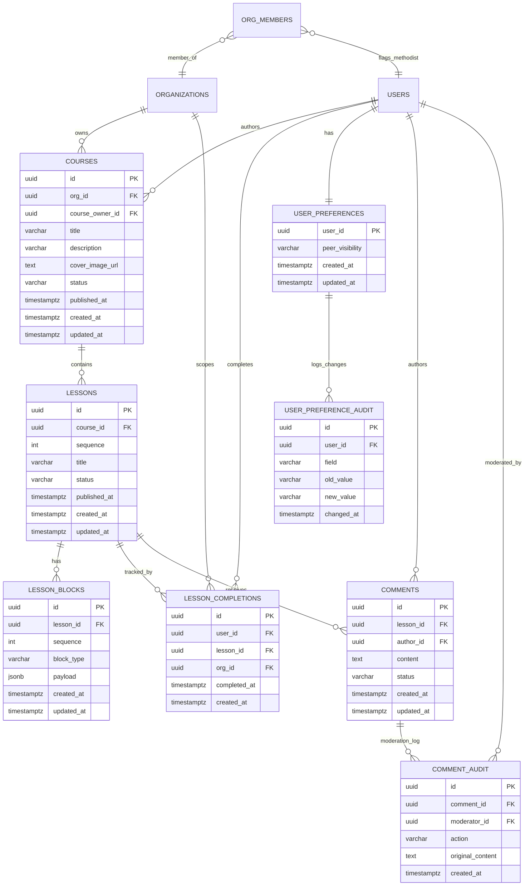

# Data model — course-lesson-mvp

<!-- Stage 08-09 → see sdlc/plugin/skills/generate-data-model/SKILL.md -->
<!-- Conventions: see `.claude/rules/migrations.md` (Match-mentorship-style: CHECKs OK, business DEFAULTs OK, updated_at OK, UUID v7 app-side, sequential naming). -->
<!-- Companion artifacts: migrations `000020..000022_*.sql`, audit report `_audit/data-model-2026-05-23.md`. -->

## Aggregate roots (4)

| Aggregate root  | Child entities                                              | Lifecycle owner                 |
|-----------------|-------------------------------------------------------------|---------------------------------|
| `courses`       | `lessons` (which in turn aggregate blocks/completions)      | `methodist` (course_owner)      |
| `lessons`       | `lesson_blocks`, `lesson_completions`                       | `methodist` (course_owner)      |
| `user_preferences` (singleton per user) | `user_preference_audit`                     | `member` (self) + GDPR audit    |
| `comments`      | `comment_audit`                                             | `member` (author) + `admin` (moderation lifecycle) |

> **Rationale for splitting `comments` from `lessons` aggregate:** comments have an independent moderation lifecycle driven by `admin` (PRD US-10) — modifying a comment must NOT require loading the parent lesson aggregate. Same reasoning for `user_preferences` as its own aggregate (privacy state is per-user, not per-org-or-course).

## ER diagram

## Entities

### `courses` (aggregate root)

| Column             | Type          | Constraints                                                                 | Notes |
|--------------------|---------------|-----------------------------------------------------------------------------|-------|
| `id`               | UUID          | PK, generated app-side (UUID v7)                                            | SAD §2 |
| `org_id`           | UUID          | NOT NULL, FK → `organizations(id)` ON DELETE CASCADE                        | tenant scope |
| `course_owner_id`  | UUID          | NOT NULL, FK → `users(id)` ON DELETE RESTRICT                               | PRD §4 US-01; RESTRICT prevents accidental owner deletion |
| `title`            | VARCHAR(200)  | NOT NULL                                                                    | PRD: title required |
| `description`      | VARCHAR(500)  | NULL                                                                        | PRD AC-02: `≤ 500` chars; bound encoded in column type |
| `cover_image_url`  | TEXT          | NULL                                                                        | PRD US-01: optional URL |
| `status`           | VARCHAR(20)   | NOT NULL DEFAULT `'draft'` CHECK IN (`'draft'`, `'published'`)              | state machine: draft → published; CHECK = DB-side safety net |
| `published_at`     | TIMESTAMPTZ   | NULL                                                                        | set on first publish (AC-06 idempotent: don't re-set on republish) |
| `created_at`       | TIMESTAMPTZ   | NOT NULL DEFAULT `now()`                                                    | |
| `updated_at`       | TIMESTAMPTZ   | NOT NULL DEFAULT `now()`                                                    | set by handler on UPDATE |

**Access patterns:**
- US-04 read by id (PK)
- list courses per org (`GET /orgs/{orgId}/courses`, PRD §6 NFR) → `idx_courses_org_id`
- list owner's drafts (admin/owner view, US-04 draft branch) → covered by `idx_courses_course_owner_id` (FK index)

---

### `lessons` (child of `courses`; aggregate root for its own content)

| Column         | Type          | Constraints                                                                  | Notes |
|----------------|---------------|------------------------------------------------------------------------------|-------|
| `id`           | UUID          | PK, app-side UUID v7                                                         | |
| `course_id`    | UUID          | NOT NULL, FK → `courses(id)` ON DELETE CASCADE                               | aggregate parent |
| `sequence`     | INT           | NOT NULL                                                                     | PRD AC-04: integer ordering within course; PRD OQ-4 (dense vs gap) deferred |
| `title`        | VARCHAR(200)  | NOT NULL                                                                     | mirrors `courses.title` bound |
| `status`           | VARCHAR(20)   | NOT NULL DEFAULT `'draft'` CHECK IN (`'draft'`, `'published'`)               | invariant: `course.status='published'` requires `COUNT(lessons WHERE status='published') ≥ 1` (PRD AC-05) — enforced in app-layer gate, not CHECK |
| `duration_seconds` | INT           | NULL CHECK (`duration_seconds BETWEEN 300 AND 14400`)                        | optional estimated duration (5 min – 4 h); used by FE to show "≈ 12 min" badge before opening a lesson. Added 2026-05-24 (demo for Lecture 6.6 drift cycle). |
| `published_at`     | TIMESTAMPTZ   | NULL                                                                         | set on first publish (AC-06 idempotent: don't re-set on republish) |
| `created_at`       | TIMESTAMPTZ   | NOT NULL DEFAULT `now()`                                                     | |
| `updated_at`       | TIMESTAMPTZ   | NOT NULL DEFAULT `now()`                                                     | |

**Constraints:**
- `UNIQUE (course_id, sequence)` — PRD AC-04b (concurrent INSERTs with same sequence → DB unique violation = 23505 → `lesson.sequence_conflict` 409). This UNIQUE index doubles as the FK index for `course_id` queries (`WHERE course_id=$1`).

**Access patterns:**
- US-04 list lessons in course ordered by sequence ASC → covered by `UNIQUE(course_id, sequence)` index scan
- US-03 publish-gate: `SELECT COUNT(*) FROM lessons WHERE course_id=$1 AND status='published'` → `idx_lessons_course_status` (composite, covers both this query and bare `WHERE course_id=$1`)

---

### `lesson_blocks` (child of `lessons` — polymorphic body per ADR-0001)

| Column       | Type        | Constraints                                                                                  | Notes |
|--------------|-------------|----------------------------------------------------------------------------------------------|-------|
| `id`         | UUID        | PK, app-side UUID v7                                                                         | |
| `lesson_id`  | UUID        | NOT NULL, FK → `lessons(id)` ON DELETE CASCADE                                               | aggregate parent |
| `sequence`   | INT         | NOT NULL                                                                                     | ADR-0001: order within lesson via integer column; rerorder = batch UPDATE |
| `block_type` | VARCHAR(20) | NOT NULL CHECK IN (`'text'`, `'video_embed'`, `'image'`, `'code'`)                          | PRD AC-03; future v1.1 types added via CHECK alteration (or remove CHECK if churn becomes painful) |
| `payload`    | JSONB       | NOT NULL                                                                                     | polymorphic per `block_type`; ADR-0001 chose JSONB-as-payload over per-type-tables. Shape per block_type — `text:{content}`, `video_embed:{url}`, `image:{url, alt}`, `code:{language, content}`. Sanitisation policy → PRD OQ-3 |
| `created_at` | TIMESTAMPTZ | NOT NULL DEFAULT `now()`                                                                     | |
| `updated_at` | TIMESTAMPTZ | NOT NULL DEFAULT `now()`                                                                     | |

**Constraints:**
- `UNIQUE (lesson_id, sequence)` — block ordering; doubles as FK index for `lesson_id` queries.

**Access patterns:**
- US-08 `GET /lessons/{id}` reads all blocks ordered by sequence → covered by `UNIQUE(lesson_id, sequence)`
- single-block edit (NFR ≤500ms per ADR-0001) → PK update

---

### `lesson_completions` (event-log; child of `lessons`)

| Column         | Type        | Constraints                                                              | Notes |
|----------------|-------------|--------------------------------------------------------------------------|-------|
| `id`           | UUID        | PK, app-side UUID v7                                                     | |
| `user_id`      | UUID        | NOT NULL, FK → `users(id)` ON DELETE CASCADE                             | |
| `lesson_id`    | UUID        | NOT NULL, FK → `lessons(id)` ON DELETE CASCADE                           | |
| `org_id`       | UUID        | NOT NULL, FK → `organizations(id)` ON DELETE CASCADE                     | denormalized for US-08 aggregation (avoids join up to courses for the hot path) — PRD AC-11 explicitly stores `org_id` on completion |
| `completed_at` | TIMESTAMPTZ | NOT NULL DEFAULT `now()`                                                 | set on first INSERT; on idempotent re-POST stays as-is (handler re-reads existing) |
| `created_at`   | TIMESTAMPTZ | NOT NULL DEFAULT `now()`                                                 | event-log; no `updated_at` (row is immutable after insert) |

**Constraints:**
- `UNIQUE (user_id, lesson_id)` — PRD AC-11 idempotency invariant; second POST → 23505 → handler returns 200 (not 201) without changing `completed_at`.

**Access patterns:**
- US-06 INSERT → unique constraint enforces idempotency
- US-06 re-read on duplicate → `WHERE user_id=$1 AND lesson_id=$2` → covered by `UNIQUE(user_id, lesson_id)`
- US-08 peer-blob aggregation: `WHERE lesson_id=$1 AND org_id=$2 [AND join up.peer_visibility='public']` → `idx_lesson_completions_lesson_org`
- FK CASCADE perf: `idx_lesson_completions_org_id` covers `ON DELETE` from `organizations`; `user_id` and `lesson_id` are covered by `UNIQUE(user_id, lesson_id)` (first-column scan) and `idx_lesson_completions_lesson_org` respectively.

---

### `user_preferences` (singleton per user; aggregate root)

| Column            | Type        | Constraints                                                                          | Notes |
|-------------------|-------------|--------------------------------------------------------------------------------------|-------|
| `user_id`         | UUID        | **PK**, FK → `users(id)` ON DELETE CASCADE                                           | 1:1 with user; PK = FK pattern (no surrogate id) |
| `peer_visibility` | VARCHAR(20) | NOT NULL DEFAULT `'private'` CHECK IN (`'public'`, `'private'`)                      | PRD AC-13: GDPR-friendly default; CHECK + DEFAULT = DB-side privacy guarantee |
| `created_at`      | TIMESTAMPTZ | NOT NULL DEFAULT `now()`                                                             | |
| `updated_at`      | TIMESTAMPTZ | NOT NULL DEFAULT `now()`                                                             | set by handler on UPSERT |

**Access patterns:**
- US-07 UPSERT WHERE user_id=$1 → PK match
- US-08 peer-blob aggregation JOIN: `lesson_completions JOIN user_preferences ON up.user_id=lc.user_id WHERE up.peer_visibility='public'` → PK FK side; sequential scan acceptable for join on small set

---

### `user_preference_audit` (immutable audit log; child of `user_preferences`)

| Column        | Type         | Constraints                                                                | Notes |
|---------------|--------------|----------------------------------------------------------------------------|-------|
| `id`          | UUID         | PK, app-side UUID v7                                                       | |
| `user_id`     | UUID         | NOT NULL, FK → `user_preferences(user_id)` ON DELETE CASCADE               | |
| `field`       | VARCHAR(64)  | NOT NULL                                                                   | which preference was changed (currently always `'peer_visibility'`; future-proof) |
| `old_value`   | VARCHAR(255) | NULL                                                                       | NULL = first set (no prior value) |
| `new_value`   | VARCHAR(255) | NOT NULL                                                                   | |
| `changed_at`  | TIMESTAMPTZ  | NOT NULL DEFAULT `now()`                                                   | immutable; no `updated_at` |

**Access patterns:**
- GDPR recall: list audit per user → `idx_user_preference_audit_user_id`

---

### `comments` (aggregate root)

| Column        | Type        | Constraints                                                                       | Notes |
|---------------|-------------|-----------------------------------------------------------------------------------|-------|
| `id`          | UUID        | PK, app-side UUID v7                                                              | |
| `lesson_id`   | UUID        | NOT NULL, FK → `lessons(id)` ON DELETE CASCADE                                    | |
| `author_id`   | UUID        | NOT NULL, FK → `users(id)` ON DELETE CASCADE                                      | |
| `content`     | TEXT        | NOT NULL                                                                          | PRD AC-17: ≤ 2000 chars enforced in handler (not VARCHAR(2000) — text replaced with placeholder on hide, length validation belongs to app) |
| `status`      | VARCHAR(20) | NOT NULL DEFAULT `'visible'` CHECK IN (`'visible'`, `'hidden'`)                   | PRD AC-18: moderation flips to `'hidden'` |
| `created_at`  | TIMESTAMPTZ | NOT NULL DEFAULT `now()`                                                          | |
| `updated_at`  | TIMESTAMPTZ | NOT NULL DEFAULT `now()`                                                          | set by handler on status change |

**Access patterns:**
- US-09 INSERT (after rate-limit check) → no special index
- list comments per lesson (paginated, NFR ≤400ms p95) → `idx_comments_lesson_created` (composite ORDER BY)
- US-10 lookup by id → PK
- FK CASCADE perf on `author_id` → `idx_comments_author_id`

---

### `comment_audit` (immutable moderation log; child of `comments`)

| Column            | Type        | Constraints                                                              | Notes |
|-------------------|-------------|--------------------------------------------------------------------------|-------|
| `id`              | UUID        | PK, app-side UUID v7                                                     | |
| `comment_id`      | UUID        | NOT NULL, FK → `comments(id)` ON DELETE CASCADE                          | |
| `moderator_id`    | UUID        | NOT NULL, FK → `users(id)` ON DELETE RESTRICT                            | preserve who hid the comment even after user-deletion |
| `action`          | VARCHAR(20) | NOT NULL DEFAULT `'hidden'` CHECK IN (`'hidden'`)                        | future-extensible (`'unhid'`, `'edited'` etc.) |
| `original_content`| TEXT        | NOT NULL                                                                 | PRD AC-18: preserve original content for compliance recall |
| `created_at`      | TIMESTAMPTZ | NOT NULL DEFAULT `now()`                                                 | immutable; no `updated_at` |

**Access patterns:**
- moderation history per comment → `idx_comment_audit_comment_id`
- moderator activity audit → `idx_comment_audit_moderator_id` (FK index, also serves compliance queries)

---

### `org_members` (existing table — ALTER only)

| Column         | Type    | Change                                                                | Notes |
|----------------|---------|-----------------------------------------------------------------------|-------|
| `is_methodist` | BOOLEAN | **NEW**, NOT NULL DEFAULT `false`                                     | PRD §6.1: `OrgMemberChecker.IsMethodist` mirrors `is_mentor` (000014). Single-step ALTER acceptable because the default is structurally honest ("not a methodist by default") — see `.claude/rules/migrations.md` §Zero-downtime patterns. |

---

## Indexes

| Index | Columns | Created in | Query it serves |
|-------|---------|------------|------------------|
| `idx_courses_org_id` | `courses(org_id)` | inline `000021` | list courses per org; FK CASCADE perf from `organizations` delete |
| `idx_courses_course_owner_id` | `courses(course_owner_id)` | inline `000021` | FK index (RESTRICT delete perf); useful for "my courses" view |
| `idx_lesson_blocks_lesson_id` (implicit via UNIQUE) | `lesson_blocks(lesson_id, sequence)` | inline `000021` UNIQUE | get blocks ordered for lesson read; doubles as FK index |
| `idx_lessons_course_sequence` (implicit via UNIQUE) | `lessons(course_id, sequence)` | inline `000021` UNIQUE | list lessons ordered; doubles as FK index |
| `idx_lessons_course_status` | `lessons(course_id, status)` | `000022` | US-03 publish-gate `WHERE course_id=$1 AND status='published'` |
| `idx_lesson_completions_user_lesson` (implicit via UNIQUE) | `lesson_completions(user_id, lesson_id)` | inline `000021` UNIQUE | idempotency check + US-08 `my_completed` flag |
| `idx_lesson_completions_lesson_org` | `lesson_completions(lesson_id, org_id)` | `000022` | US-08 peer-blob `WHERE lc.lesson_id=$1 AND lc.org_id=$2` (the hot path) |
| `idx_lesson_completions_org_id` | `lesson_completions(org_id)` | inline `000021` | FK CASCADE perf from `organizations` delete |
| `idx_user_preference_audit_user_id` | `user_preference_audit(user_id)` | inline `000021` | GDPR compliance recall per user |
| `idx_comments_lesson_created` | `comments(lesson_id, created_at DESC)` | `000022` | `GET /lessons/{id}/comments` paginated reverse-chronological |
| `idx_comments_author_id` | `comments(author_id)` | inline `000021` | FK CASCADE perf; "my comments" view |
| `idx_comment_audit_comment_id` | `comment_audit(comment_id)` | inline `000021` | moderation history per comment |
| `idx_comment_audit_moderator_id` | `comment_audit(moderator_id)` | inline `000021` | FK RESTRICT perf; moderator activity audit |

**Indexes deliberately NOT added** (would be premature without a concrete query): no `idx_lessons_published_partial`, no `idx_comments_status` (visible default; queries always filter by lesson_id which is already indexed).

## Out of scope for v1 (deferred — tracked in audit report)

- **`media_blobs` table** (ADR-0001 mentions it as future companion for S3-hosted images/videos). PRD §3 Non-goals: no native video upload in v1 (`embed_url` only). PRD OQ-2 (image storage strategy — external URL vs S3 upload) open until 2026-05-28. When OQ-2 closes with "S3 upload" decision → add `media_blobs` in a follow-up migration; `lesson_blocks.payload.blob_id` will reference it. Current v1 stores image/video URLs as external strings in `payload.url`.
- **Outbox table** for `lesson.created` / `course.published` events (PRD events.md). Decision deferred: the sequences in `sad.md §6` show `INSERT outbox event_type='...'` but the outbox-table schema is identical for any module and may be introduced once at platform level, not per-feature. Tracked as open question for `define-api` stage.

## Test fixtures

NOT generated in this pass. Repo's existing test pattern (`internal/modules/mentorship/app/app_test.go`) is mock-based — `mockSessionRepo` etc. No integration tests against a real DB yet. When integration tests are introduced for course-lesson-mvp, place factory functions under `internal/testfixtures/<entity>.go` following the convention in `.claude/rules/migrations.md` §Seeds.

## Migration files index

- `000020_add_is_methodist_to_org_members.up.sql` / `.down.sql` — ALTER existing.
- `000021_create_course_lesson_tables.up.sql` / `.down.sql` — 8 new tables + inline FK indexes + UNIQUE constraints.
- `000022_add_course_lesson_indexes.up.sql` / `.down.sql` — composite indexes per query justification (US-03 publish-gate, US-08 peer-blob, comment pagination).

## Open questions handled / forwarded

| OQ | Topic | This skill's call |
|----|-------|-------------------|
| OQ-1 | `embed_url` allowlist (provider hosts) | application-layer concern, no DB impact |
| OQ-2 | image-block storage (URL vs S3) | DB impact deferred — see `media_blobs` above |
| OQ-3 | text/code block sanitization policy | application-layer, no DB impact |
| OQ-4 | sequence numbering convention (dense vs gap) | column type `INT NOT NULL` works for both; reorder logic is app-side |
| OQ-7 | anti-fingerprinting threshold (3 vs 5) | application-layer (read path filter), no DB impact |
| OQ-8 | peer-blob cache invalidation | infrastructure-layer (Redis), no DB impact |
