# Software Architecture Document — course-lesson-mvp

<!-- Stages 04-05 → see sdlc/plugin/skills/architecture-design/SKILL.md -->
<!-- 12 Arc42 sections. Empty sections — <!-- N/A: <one-line reason> -->. -->
<!-- C4 Context (L1) lives inline in §3. C4 Container (L2) lives inline in §5. -->

## 1. Introduction and goals

**Intent.** Course-lesson-mvp розширює BeerLMS з інструмента для 1-on-1 mentorship у платформу для асинхронної доставки курсів.

Flow:

- `methodist` створює `course`;
- додає до нього `lesson` з блоків (текст / вбудоване відео / картинка / код);
- публікує;
- `member` тієї ж org читає урок, відмічає його як завершений (з тумблером приватності), бачить peer-completion signal (агрегований сигнал «скільки сусідів вже завершили цей урок» — з порогом проти fingerprinting, щоб не можна було ідентифікувати конкретну людину), і коментує урок (тільки текстом, без вкладених тредів у v1).

Це Approach C з idea-brief §13 (RICE = 81). Ключові деталі: блочна структура тіла уроку + сутність `lesson_completion` з налаштуванням приватності + плоска гілка коментарів. Це і є основний v1 differentiator — він мітигує «devil's-vector» з idea-brief: «methodist створив один курс і пропадає». Real-time engagement signal від member-ів дає автору відчуття, що його контент читають.

**Top-3 quality goals (1-liners; full scenarios у §10; визначення термінів у §12):**

1. **QG-1 Privacy/Confidentiality — peer-дані огороджені межами org + захист від fingerprinting + GDPR consent.** `peer_visibility` за замовчуванням `private` для нових member-ів. Лічильники прихані, якщо у org менше 3 completions на конкретний урок (порог проти ідентифікації). Усі зміни приватності логуються у `user_preference_audit` для GDPR recall (PRD §6.1; AC-13, AC-15).
2. **QG-2 Security — захист від кількох типів зловживань.** Cross-org існує-чи-ні приховується через 404 на чужий published course (PRD AC-07); leak чорновика виключений фільтром по `(org_id, status, course_owner_id)`; SSRF у `video_embed.url` блокується allowlist host-ів; XSS у коментарях — HTML-escape на сервері; rate-limit 30 req/min на POST /courses і 10/h на POST /comments (PRD §6.1 abuse cases #1-#5, #7, #8).
3. **QG-3 Availability — нові routes наслідують BeerLMS-API SLO 99.9% rolling 30-day window.** Нові routes (`*/courses`, `*/lessons`, `*/completion`, `*/comments`) включені у існуючий error budget. Якщо Redis-кеш peer-blob падає — урок все одно віддається (запасний шлях — пряме читання з БД, з вищою затримкою; це accepted higher-latency mode).

**Performance fallout.** PRD §6 NFR latency-targets (`POST /courses` ≤250 мс, `GET /lessons/{id}` з peer-blob ≤400 мс, `POST /completion` ≤200 мс, `POST /comments` ≤400 мс, throughput ≥30 req/s) свідомо виходять з §10 Top-3 і верифікуються через k6 load-test у CI pipeline (без окремих §10 сценаріїв). Stale peer-blob у 60-секундному Redis TTL — це §8 Crosscutting (конвенція кешу) + §11 Risk-row, accepted UX trade-off.

**Stakeholders.**

| Role | Interest | Sign-off owner? |
|---|---|---|
| `methodist` | Створює/публікує courses+lessons; отримує engagement-feedback через peer-completion signal | No |
| `course_owner` | Editor/publisher subset методиста для конкретного course (full rights only на own course) | No |
| `member` | Споживає published content, mark-complete, comment, manage privacy preference | No |
| `admin` | Org-scoped moderation (hide comments via PRD AC-18); не editor контенту | No |
| Tech Lead | Architecture sign-off; reviews ADRs | **Yes** |
| Security Lead | §6.1 abuse cases (cross-org leak, draft leak, SSRF, comment XSS, rate limits) — PRD §6.1 «Required + elevated» verdict | **Yes** |
| Privacy Engineer | GDPR consent flow + peer-visibility default + anti-fingerprinting threshold + `user_preference_audit` log | **Yes** |
| PM | §10 Quality Goals confirmation + §7 KPIs (peer-engagement, opt-in rate, comment engagement) | No |

## 2. Constraints

**Technical.** (verified by Step 3 Explore subagent against `internal/modules/mentorship/` as shipped reference)
- Go 1.25.0 (Alpine 3.23 runtime image).
- chi v5.2.5 (HTTP router; existing global rate-limit 60 req/min/IP at chi-middleware layer).
- pgx/v5 (Postgres async pool; raw SQL — **no** sqlc codegen у репо).
- Postgres ≥ 15 (assumed production version — confirm at Stage 08 data-model).
- golang-migrate/migrate v4 (embedded SQL `/migrations/*.sql` via `iofs`).
- UUID v7 (google/uuid) — ID strategy for **all** new entities (`courses.id`, `lessons.id`, `lesson_completions.id`, `comments.id`, `user_preferences.user_id` — composite or FK).
- golang-jwt/jwt v5 — JWT validation; Google OAuth via `golang.org/x/oauth2`.
- swaggo/http-swagger v2 — auto-docs at `/swagger`.
- **NEW shared infrastructure:** Redis ≥ 7.2 — required for (a) лічильник запитів на користувача для rate-limit (PRD §6.1 abuse cases #4, #8), і (b) кеш peer-blob з 60-секундним терміном життя (PRD §6 NFR ≤400 мс peer-enriched read). Rationale + alternatives → ADR-0002.

**Organisational.**
- Effort budget: 3-5 person-weeks (PRD frontmatter `feature_size: M`; idea-brief §11 RICE `E = 3`; §12 Time-feasibility ✓ для 4-6w window).
- Deadline: Q3 onboarding cycle **hard** — idea-brief §4 «Q3 onboarding cycle потребує асинхронної доставки знань як must-have».
- Team: BeerLMS backend + ~0.5 frontend (effective composition; PM-confirmed at sprint planning).
- DevOps capacity для введення Redis: required (ADR-0002 Negative consequence). §11 Risk-row tracks this dependency.

**Conventions.**
- **No root CLAUDE.md** (Explore §f). Effective convention reference = `internal/modules/mentorship/` shipped pattern (5 weeks production).
- DDD layering: `domain/` (entities + sentinel errors) → `app/` (use cases + authz via `OrgMemberChecker`) → `infra/` (Postgres repos з raw SQL via pgx; checker impl) → `ports/` (chi handler + DTO + `errors.go` для domain→HTTP map) → `module.go` (DI wiring factory).
- Error codes: `module.snake_case` — `course.not_found`, `lesson.sequence_conflict`, `lesson.not_found`, `comment.not_moderator`, `validation.description_too_long`, `validation.comment_too_long`, `validation.reorder_payload_too_large`, `rate_limited`. Mapping через `mapError()` у `ports/errors.go` → `apperr.Error{Code, Message, StatusCode}`.
- AuthZ: `OrgMemberChecker` interface — query `org_members WHERE org_id = $1 AND user_id = $2` для role/flag checks. Mentorship use `IsMentor`; новий feature додає `IsMethodist` (PRD AC-09) і `IsAdmin` (PRD AC-18). **Mandatory invariant:** всі repo SELECT-и фільтрують `org_id = $1` (mentorship parity; cross-org leak виключений архітектурно).
- HTTP routing: nested під `/api/v1/orgs/{orgId}/...` через `orgmw` middleware → `OrgContext{OrgID, OrgRole}` (Explore §f).
- Pagination: cursor-based composite `time.RFC3339Nano + "|" + UUID` (Explore §f).
- Side-effects pattern: domain-interface + composite-listener (mentorship `SessionLifecycleListener` + `NewCompositeSessionListener` fan-out). v1 course-lesson **no listeners** — email/push notification у PRD §3 Non-goals.

**Regulatory / external.**
- **GDPR** — privacy-by-default consent flow (PRD §6.1 GDPR consent block, AC-13); `user_preference_audit{user_id, old, new, changed_at}` для compliance recall; user-deletion semantics для `lesson_completions`, `user_preferences`, `comments` treated as user-generated PII-adjacent data. Privacy Engineer sign-off required.
- **Security review verdict:** «Required + elevated» per PRD §6.1 — SecEng + PrivacyEng review перед merge.
- No PCI / SOC2 applicable у v1 (no payment data; no compliance-classified data beyond GDPR).

## 3. Context and scope

<Business context in 2-3 sentences. What the system does for whom.>

**External systems (in / out):**

| Actor or system | Type | Interaction |
|---|---|---|
| <e.g. IC> | Person | Creates goals, adds checkpoints |
| <e.g. notification-service> | System (internal) | Receives cron registration |
| <e.g. Identity Provider> | System (external) | Provides JWT tokens |

**C4 Context (L1):**

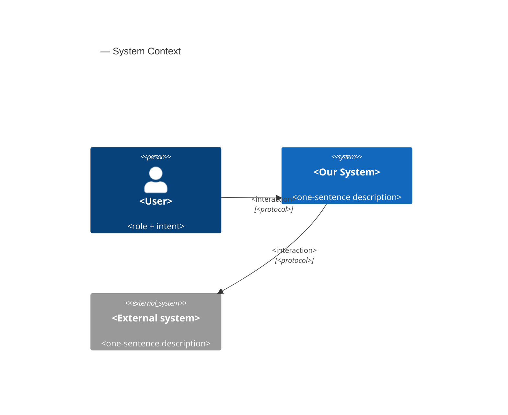

## 4. Solution strategy

**Top-3 strategic choices (the seeds for ADRs):**

1. **<e.g. Module isolation through events>** — <2-3 sentences rationale referencing Quality Goals and constraints>.
2. **<e.g. Single-store persistence (Postgres)>** — <2-3 sentences>.
3. **<e.g. Server-rendered dashboard>** — <2-3 sentences>.

Each tactical decision in later sections should be traceable to one of these strategic seeds. Tactical decisions that *contradict* a strategic choice are red flags — surface them in §11 Risks.

## 5. Building block view

<One paragraph: layered / hexagonal / clean / event-driven. Why.>

**Internal decomposition:**

```
<e.g. internal/modules/goals/>
├── domain/       <entities + sentinel errors>
├── app/          <use cases / services>
├── infra/        <repository + outbox impl>
├── ports/        <HTTP handlers, DTOs, error mapping>
└── module.go     <self-wiring>
```

**C4 Container (L2):**

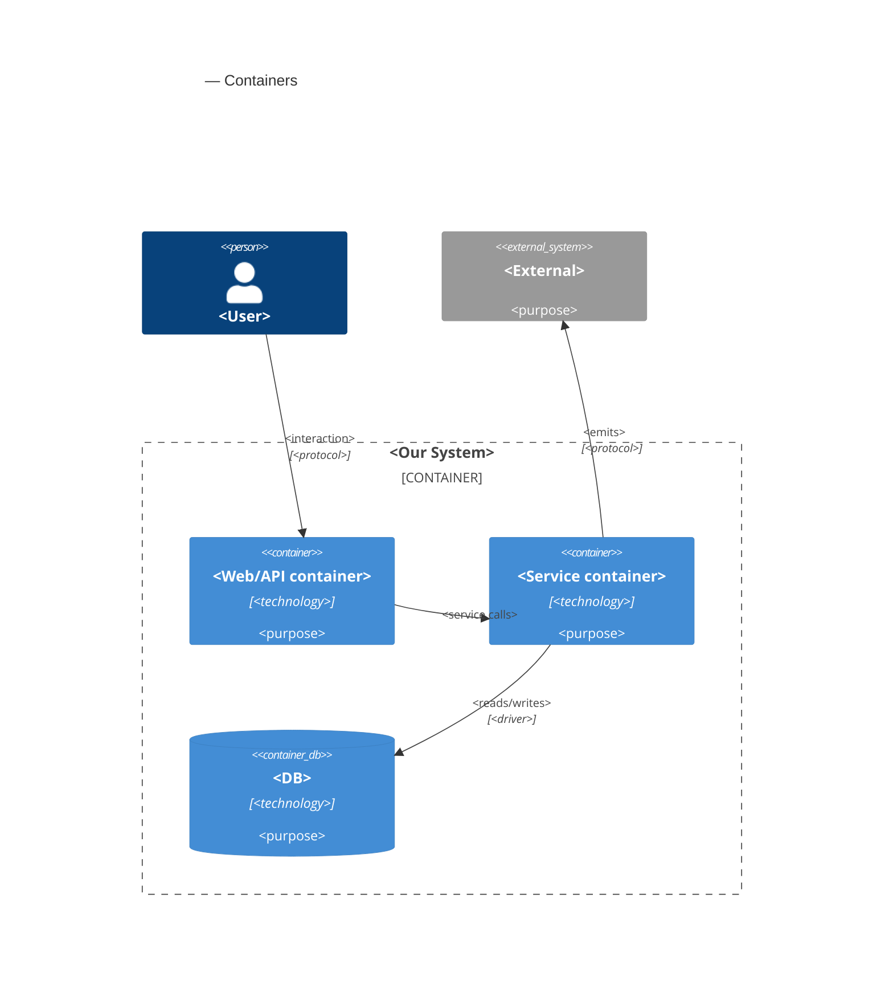

## 6. Runtime view

<!-- Container-level sequences (US-NN; учасники = логічні модулі / спільна інфраструктура; без HTTP-verbs у параметрах). -->
<!-- Endpoint-level sequences inlined нижче під `### Endpoint-level: …` (HTTP verbs, status codes, alt-branches). -->
<!-- Sequence coverage audit: `_audit/sequences-2026-05-23.md`. -->

### US-01: createCourse (draft)

<!-- Participants: <ui>=SPA, <service>=BeerLMS API, <cache>=Redis, <data-store>=primary DB -->

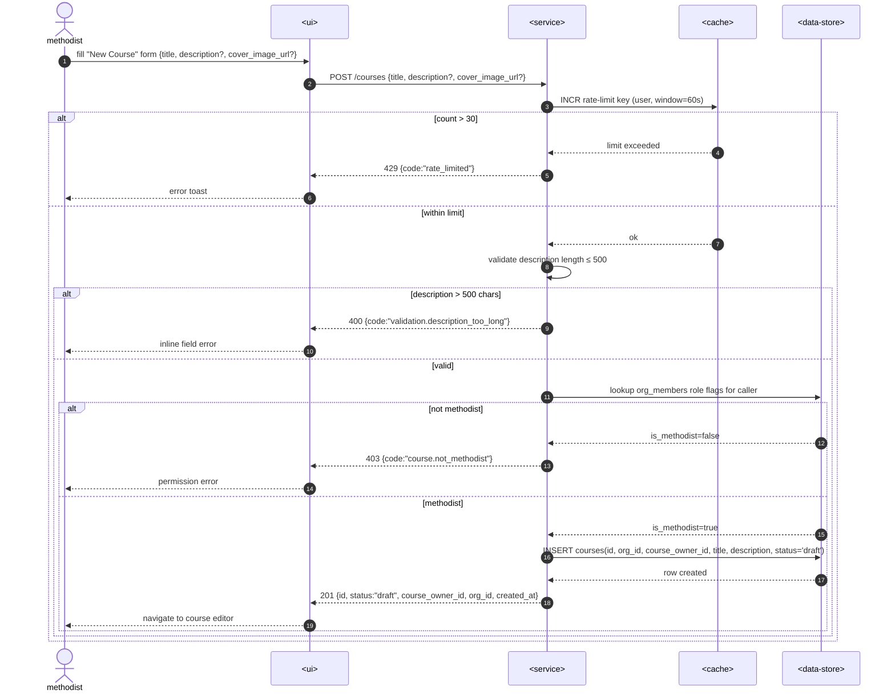

### US-02: addLesson (block-based)

<!-- Participants: <ui>=SPA editor, <service>=BeerLMS API, <data-store>=primary DB, <external-system>=outbox consumers -->

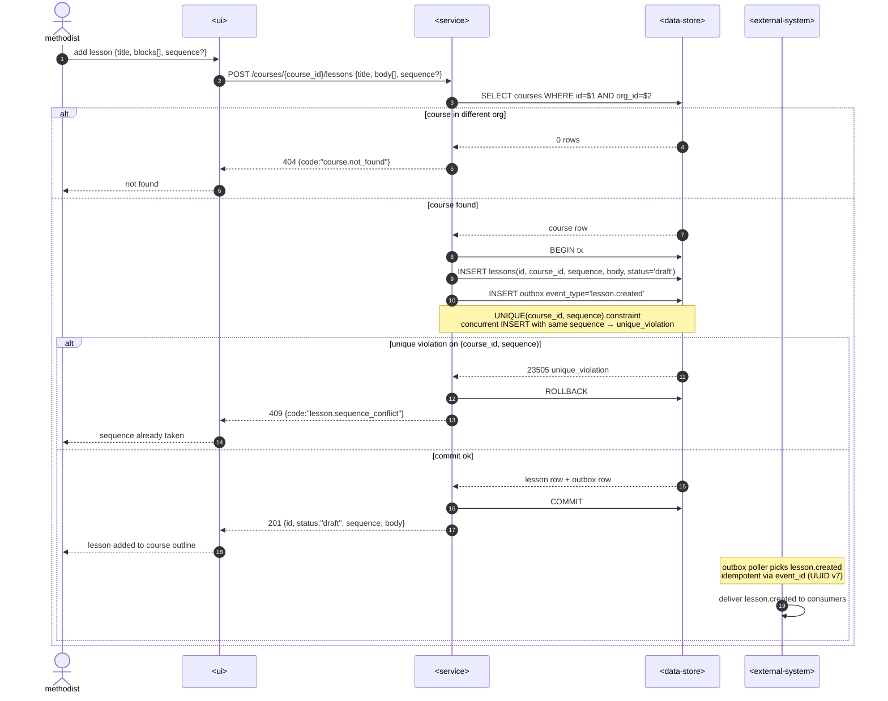

### US-03: publishCourse

<!-- Participants: <ui>=SPA, <service>=BeerLMS API, <data-store>=primary DB, <external-system>=notification/downstream service -->

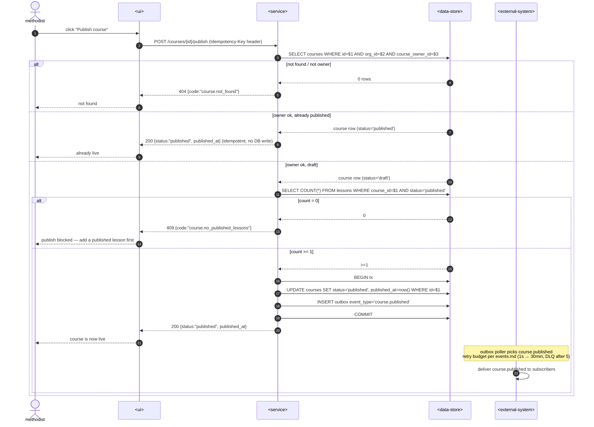

### US-04: viewCourse (cross-org 404)

<!-- Participants: <ui>=SPA, <service>=BeerLMS API, <data-store>=primary DB -->

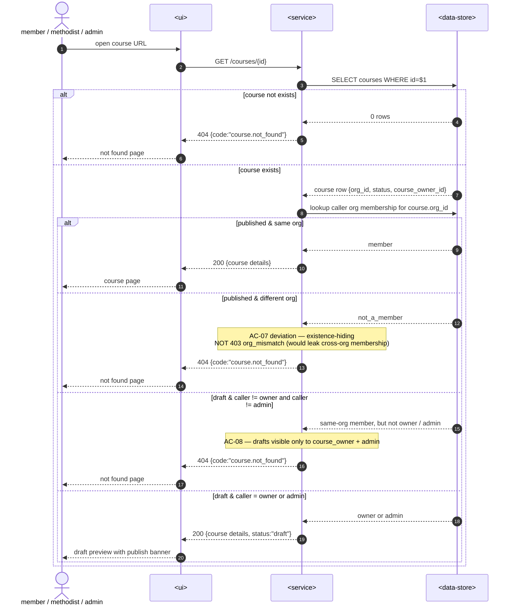

### US-05: reorderLessons

<!-- Participants: <ui>=SPA lesson-outline editor, <service>=BeerLMS API, <data-store>=primary DB -->

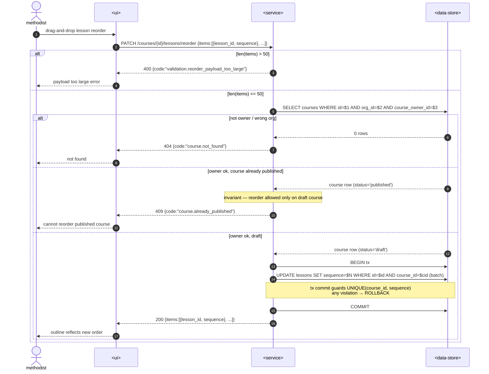

### US-06: markLessonComplete (idempotent)

<!-- Participants: <ui>=SPA lesson reader, <service>=BeerLMS API, <data-store>=primary DB -->

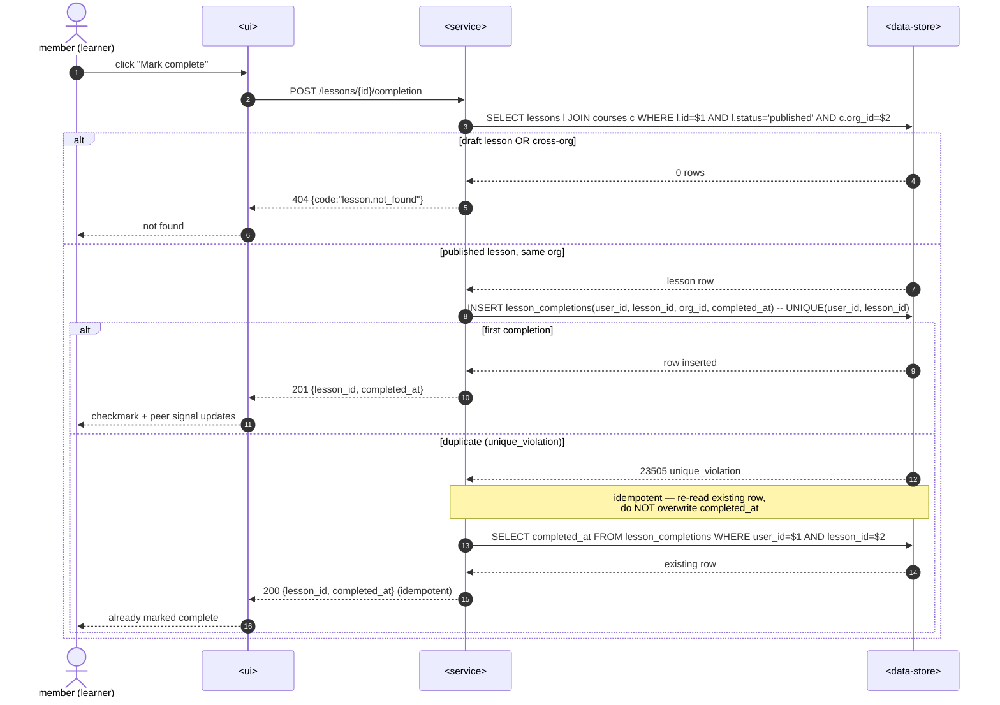

### US-07: setPeerVisibilityPreference

<!-- Participants: <ui>=SPA settings page, <service>=BeerLMS API, <data-store>=primary DB (includes audit table) -->

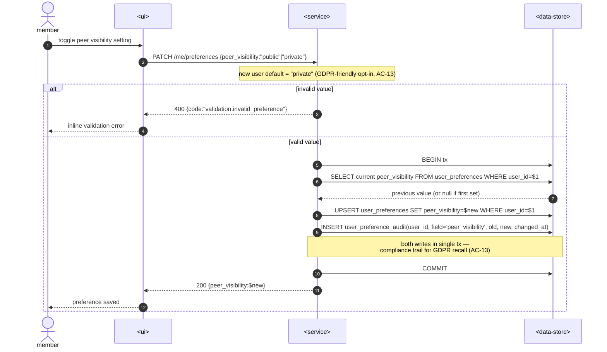

### US-08: viewLessonWithPeerSignal

<!-- Participants: <ui>=SPA lesson reader, <service>=BeerLMS API, <cache>=Redis peer-blob, <data-store>=primary DB -->

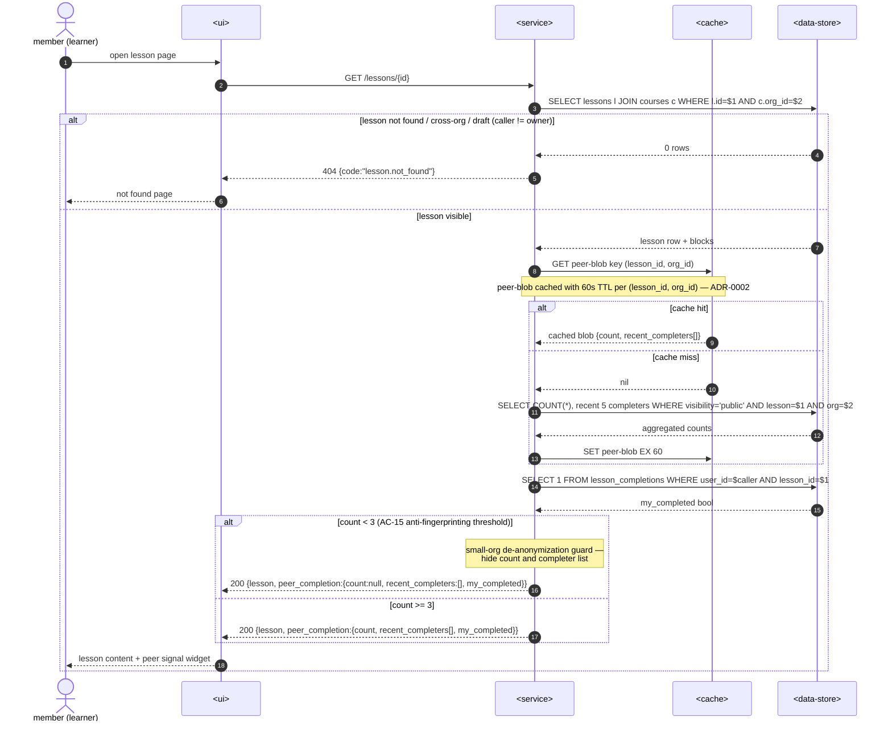

### US-09: createComment

<!-- Participants: <ui>=SPA lesson reader, <service>=BeerLMS API, <cache>=Redis rate-limit, <data-store>=primary DB -->

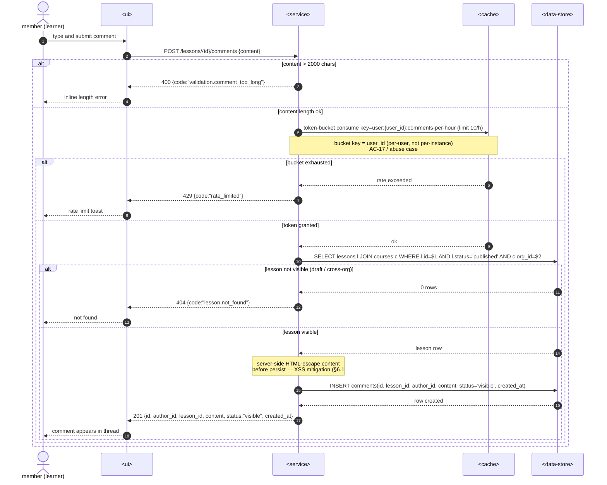

### US-10: hideComment (moderation)

<!-- Participants: <ui>=SPA moderation panel, <service>=BeerLMS API, <data-store>=primary DB (includes audit table) -->

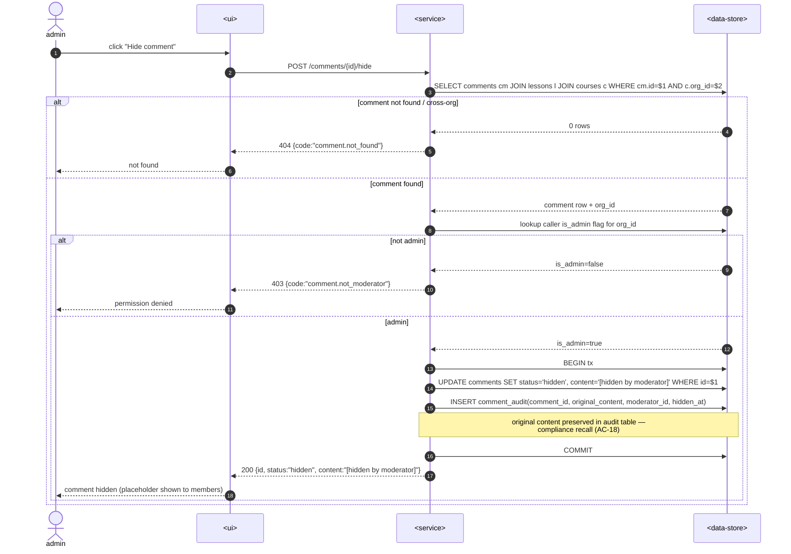

### Endpoint-level: `POST /lessons/{id}/publish`

Двошарова дисципліна: контейнерний рівень (`US-NN` вище) лишається без HTTP verbs, а endpoint-level нижче розгортає той самий flow з конкретним контрактом — який код повертає сервер при cross-methodist publish, де закінчується транзакція, коли outbox poller підхоплює подію. Це той самий рівень деталі, що `openapi.yaml` для `publishLesson` operationId, тільки розгорнутий у часі.

<!-- Participants: <client>=SPA, <service>=BeerLMS API, <data-store>=primary DB, <external-system>=CDN/media worker -->

```mermaid
sequenceDiagram
    autonumber
    participant C as <client>
    participant SVC as <service>
    participant DS as <data-store>
    participant EXT as <external-system>

    C->>SVC: POST /lessons/{id}/publish (Idempotency-Key header)
    SVC->>DS: SELECT lesson WHERE id=? AND course_owner_id=?
    alt lesson not found OR not owned
        DS-->>SVC: 0 rows
        SVC-->>C: 404 / 403 {code, message}
    else lesson found, draft status
        DS-->>SVC: lesson row
        SVC->>DS: SELECT blocks WHERE lesson_id=? ORDER BY sequence
        DS-->>SVC: ordered blocks
        SVC->>DS: BEGIN; UPDATE lessons SET status='published', published_at=now() WHERE id=?
        SVC->>DS: INSERT outbox (event_type='lesson.published', payload=...)
        SVC->>DS: COMMIT
        SVC-->>C: 200 {lesson with status=published}
        Note over EXT: outbox poller picks event
        EXT->>EXT: invalidate cache for lesson path
    end
```

Drift check vs `openapi.yaml`:

- `POST /lessons/{id}/publish` — присутній у `paths`, operationId `publishLesson`.
- Response codes у diagram (200 / 403 / 404) — присутні у `responses` block of `publishLesson` operation.
- Error codes (`lesson.not_found`, `lesson.forbidden`) — використовуються у `ErrorResponse.code` per common convention `module.error_name`.
- Outbox INSERT у тій самій транзакції з UPDATE — відповідає `lesson.published` event з `contracts/events.md`.

## 7. Deployment view

<Topology in 2-3 sentences. Where it runs (k8s / VM / serverless), replicas, scaling thresholds.>

**Monitoring:**
- <Metrics — e.g. Prometheus `<metric_name>`>
- <Alerts — e.g. "outbox lag > 10 min → page on-call">
- <Tracing — e.g. OpenTelemetry HTTP spans>

**Scaling thresholds:**
- <e.g. 500 IC × 5 goals × 26 checkpoints/Q = 65k rows/year — comfortable in one table>
- <e.g. partitioning by quarter at >500k rows/year>

<!-- For XS/S that doesn't change deployment: <!-- N/A: feature reuses existing deployment unit -->. -->

## 8. Crosscutting concepts

| Concept | Convention | Where defined |
|---|---|---|
| Logging | <e.g. structured slog, fields `module=<name>`> | <CLAUDE.md §X or here> |
| Authentication | <e.g. JWT via session middleware> | <CLAUDE.md §X> |
| Error handling | <e.g. domain sentinel → ports/errors.go → apperr JSON> | <CLAUDE.md §X> |
| ID strategy | <e.g. UUID v7 in app layer> | <CLAUDE.md §X> |
| Internationalisation | <e.g. N/A, English only> | — |
| Observability | <e.g. OpenTelemetry on HTTP boundaries> | — |
| Outbox / events | <module-specific patterns, if any> | <here> |

## 9. Architecture decisions

| # | Title | Status | Section |
|---|---|---|---|
| 0001 | Зберігати урок як таблицю блоків різних типів | Accepted | §4 |
| 0002 | Додати Redis як спільну інфраструктуру для rate-limit + peer-blob кешу | Accepted | §2, §4, §8 |

ADR files live under `docs/features/<slug>/adr/NNNN-<title>.md`.

Дивись: [[adr/0001-content-storage-strategy]] · [[adr/0002-add-redis-as-shared-infrastructure]]

## 10. Quality requirements

Each top-3 goal from §1 expanded into a full scenario:

**QG-1. <quality attribute>**
- **When:** <trigger condition>
- **Then:** <expected behavior with numbers from PRD NFR>
- **How verify:** <test / chaos drill / load test / observability>

**QG-2. <quality attribute>**
- **When:** <trigger>
- **Then:** <expected>
- **How verify:** <how>

**QG-3. <quality attribute>**
- **When:** <trigger>
- **Then:** <expected>
- **How verify:** <how>

## 11. Risks and technical debt

<!-- Severity column literals: Low / Medium / High for regular risks; "Open question" for rows
     created by Step-7 `Save as Open Question` resolutions (see references/socratic-loop.md). -->

| Risk / debt | Severity | Mitigation | Owner |
|---|---|---|---|
| <e.g. Outbox lag may reach hours during downstream outage> | Medium | <Alert >10 min, on-call playbook, retry backoff> | <DevOps> |
| <e.g. No event schema versioning in v1> | Medium | <ADR-NNNN planned for v2, graceful handling of unknown fields> | <Backend> |
| Open architectural decision: <decision-headline> | Open question | Resolve before <stage trigger or YYYY-MM-DD>; <inline rationale from Step-7 Save-as-OQ> | <owner> |

**Accepted debt (acceptable in v1, plan to fix later):**
- <e.g. Goal entity is not versioned (immutable) — OK for v1, may need audit versioning in v2>

## 12. Glossary

| Term | Meaning |
|---|---|
| <e.g. Goal> | <quarterly intent in statement form> |
| <e.g. KR> | <Key Result — measurable target linked to a Goal> |
| <e.g. Checkpoint> | <bi-weekly progress update on a KR> |
