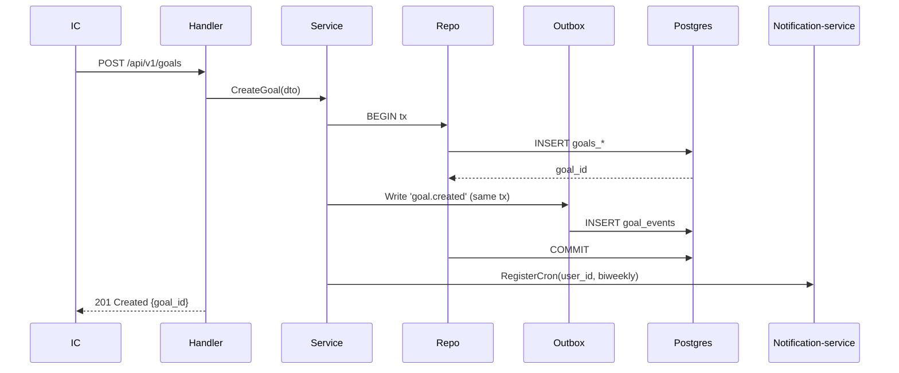
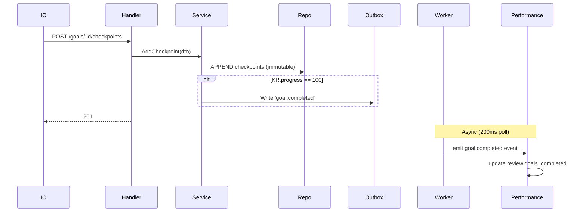
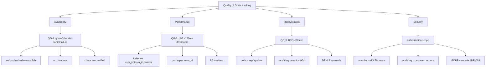

# arc42: Goals tracking — TeamHub

## 1. Introduction and Goals

### 1.1 Requirements Overview
*(reference з brief §1 Context)* Goals tracking module у TeamHub. IC створюють quarterly Objectives + 3-5 KR, EM бачить team dashboard, performance receives `goal.completed` events.

### 1.2 Quality Goals
*(з brief §2 Quality Goals + §10 Quality Tree нижче)*
- QG-1 Availability під partial failure
- QG-2 Performance under growth (p95 ≤120ms)
- QG-3 Recoverability (RTO <30 min)

### 1.3 Stakeholders

| Role | Concern |
|---|---|
| IC | Own goals, biweekly checkpoints, low friction |
| EM | Team dashboard, 1-1 prep, quarter review |
| HR (post-MVP) | Звітність по командах |
| DevOps | Operational simplicity, monitoring, alerts |
| Backend team | Maintainability, evolution, hexagonal consistency |
| Security/legal | GDPR compliance, audit log на cross-team |

## 2. Constraints

*(verbatim з brief §3 Constraints)*

Tech: `go@1.26`, `chi@5.1.0`, `pgx@5.7.x`, `postgres@18`, `google/uuid@1.6.0`, `sethvargo/go-limiter@1.0.0`.
Architecture: module isolation through events, outbox pattern, UUID v7 everywhere.
Organizational: 3 person-weeks effort, Q3 2026-07-01 deadline (hard).
Regulatory: GDPR (ADR-003 in progress), audit log на cross-team access.

## 3. Context and Scope

*(reference з brief §1 + technical context)*

Внутрішні модулі (як external з goals perspective): `user` (FK), `team` (membership), `performance` (outbox consumer), `notification-service` (cron register).

Зовнішні: — (немає third-party у v1).

Trust boundary: усі internal HTTP — within K8s cluster, mTLS. External — лише через kubectl HTTPS ingress.

## 4. Solution Strategy ⭐

### 4.1 Module isolation through events
Goals і performance координуються через outbox events, не FK. Refactor performance не блокується goals (TICKET-9201 incident не повториться). Reference: ADR-001, ADR-002.

### 4.2 Postgres-only persistence
Single source of truth. Без Redis cache layer (cache як memoization у app, не окремий service), без Mongo, без специальних storage. Materialized views для read scaling за threshold. Простіше operate, fewer dependencies.

### 4.3 Server-rendered EM dashboard
Не SPA, не client-side rendering. Latency budget на server side (p95 ≤120ms per QG-2). Client просто рендерить HTML. Faster TTI, простіше для SEO + future internal share.

## 5. Building Block View

*(brief §4 + повний C4 L2 у `diagrams/c4-container.md`)*

High-level: TeamHub-API monolith з 5 modules (goals, performance, user, team) + HTTP handler + outbox worker як goroutine. Postgres 18 — common DB.

Goals module internal — hexagonal (domain/app/infra/ports), деталі у `diagrams/c4-component-goals.md`.

## 6. Runtime View

*(brief §5 + Mermaid sequence diagrams для критичних flows)*

### 6.1 Create goal flow

### 6.2 Add checkpoint + propagate

## 7. Deployment View

*(brief §6 + C4 deployment-style description)*

- K8s, 3 replicas (HA, anti-affinity per node)
- Postgres 18 cluster (primary + 1 read replica)
- Goals tables `goals_*`, events `goal_events` у тому ж DB
- Outbox worker — goroutine у TeamHub-API process
- Monitoring: Prometheus, Grafana, alerts на outbox lag
- Scaling thresholds: 500 IC → partitioning per quarter

## 8. Crosscutting Concepts ⭐

### 8.1 Logging
Structured `slog` з fields `module=goals, operation=<name>, user_id=<id>`. Per TeamHub-API CLAUDE.md.

### 8.2 Error handling
Domain sentinel errors (`errors.New("goal.not_found")`) → ports/errors.go → `apperr.Error{Code, Message, StatusCode}` → JSON. Per TeamHub convention.

### 8.3 Authentication & authorization
JWT через session middleware. Goals-specific authorization:
- Member: read/write only own goals
- EM: read team's goals (where `user.team_id == em.team_id`)
- HR: read all (post-MVP, з audit log)

### 8.4 ID strategy
UUID v7 у app layer (sortable timestamp prefix). Cursor pagination compatible. Per TeamHub convention (NOT `gen_random_uuid()` у DB).

### 8.5 Outbox writing pattern
Кожен write до Goal/KR/Checkpoint + outbox event у тій же tx. Worker poll 200ms, emit, mark published. Backoff 1s/5s/30s/5min/30min, DLQ.

### 8.6 Cache invalidation
Write до Goal/KR/Checkpoint → invalidate `team_id` cache key (для EM dashboard). In-memory або через Redis (TBD post-MVP).

## 9. Architecture Decisions

| # | Title | Status | Date | Summary |
|---|---|---|---|---|
| ADR-001 | Окремий module `goals/` замість subdomain | accepted | 2026-05-15 | Clean boundary > reuse. Reference: `adr/0001-*.md` |
| ADR-002 | Outbox pattern для events (не Kafka) | accepted | 2026-05-15 | Postgres-native, DevOps може operate. Reference: `adr/0002-*.md` |
| ADR-003 | GDPR cascade vs anonymize | in_progress | — | Legal review pending |
| ADR-004 | Event schema versioning | proposed | — | Defer until first schema change |

## 10. Quality Requirements (Quality Tree) ⭐

## 11. Risks and Technical Debt ⭐

| Risk | Severity | Mitigation | Owner |
|---|---|---|---|
| EM-driven adoption — member не оновлює без push | High | Training session pre-Q3, Slack reminder template | @feature-owner |
| Outbox lag може досягти годин при performance outage | Medium | Alert >10min, on-call playbook, retry backoff | DevOps |
| Schema evolution для events — версіонування нема у v1 | Medium | ADR-004 (proposed), graceful unknown fields | Backend |
| Initial deploy має downtime risk | Low | Blue/green rollout, feature flag `goals_enabled` | DevOps |

**Technical Debt (acceptable у v1, виправляємо у v2+):**
- Goal entity не має versioning (immutable). Audit потребує у v2.
- performance consumer не bulletproof idempotent (accept duplicate через event_id, але код not robust). Refactor у v2.

## 12. Glossary ⭐

| Term | Definition |
|---|---|
| **Goal (Об'єктив)** | Quarterly intent IC у формі statement (≤200 chars) |
| **Key Result (KR)** | Measurable target з due date, прив'язаний до Goal |
| **Checkpoint** | Biweekly progress update на KR (immutable після create) |
| **Quarter** | `"2026-Q3"` string format, узгоджено з performance модулем |
| **Owner** | IC, який створив goal (immutable після create) |
| **Team rollup** | Aggregate progress %, обчислений з останніх checkpoints |
| **Outbox event** | DomainEvent у `goal_events` таблиці, async emitted to performance |
| **RICE score** | Reach × Impact × Confidence ÷ Effort (з brief priority) |
| **DLQ** | Dead-letter queue для events, які failed N retries |
