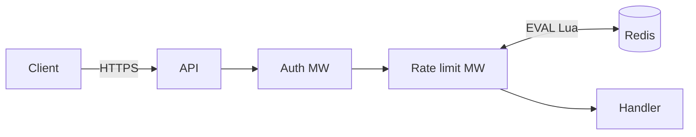

# Architecture brief — Rate limiting

**Architect:** Kyrylo
**Date:** 2026-05-14

## Goal
Додати middleware у API, який перевіряє per-user rate у Redis і відмовляє з `429` при перевищенні.

## Components
- **`middleware/ratelimit`** — новий пакет в API, обертає кожен handler. New.
- **Redis cluster** — використовуємо існуючий, ключі під префіксом `rl:`. Existing.
- **Auth middleware** — лишається попереду rate limit (треба user_id). Existing.

## Boundaries
- `middleware/ratelimit` володіє Redis-операціями для ключів `rl:<user_id>`.
- Інші модулі не торкаються `rl:*` ключів.
- Конфіг (RPM, window) — env vars + central config.

## Data flow

## Tech stack
- Language: Go 1.26 (існуючий API).
- Storage: Redis 7 (існуючий cluster).
- Algorithm: sliding window log via atomic Lua script.

## Security / privacy impact
- Trust boundaries: external client -> API auth -> rate limit middleware -> Redis.
- Sensitive data: `user_id` is used only as a Redis key suffix and should be hashed/redacted in logs.
- Threats considered: auth bypass by spoofed body params, Redis key collision, hot-key DoS.
- Required review: N/A for S-size internal middleware change; review checklist covers controls.

## Trade-offs

| Decision | Chosen | Rejected | Why |
|---|---|---|---|
| Algorithm | Sliding window log | Token bucket | Точність для AC-01; пам'ять терпима (~100 entries/user) |
| Storage | Redis cluster | In-memory per-replica | Shared state потрібен між replicas |
| Failure mode | Fail-open | Fail-closed | Rate limit не повинен зменшувати API availability |
| Limit config | Env vars (single tier) | DB-driven tiers | Фаза 1 — один tier; tier-system у фазі 2 |

## Open questions
- [x] Алгоритм: sliding window. Закрито ADR-0007.
- [x] Fail mode: fail-open. Закрито ADR-0008.
