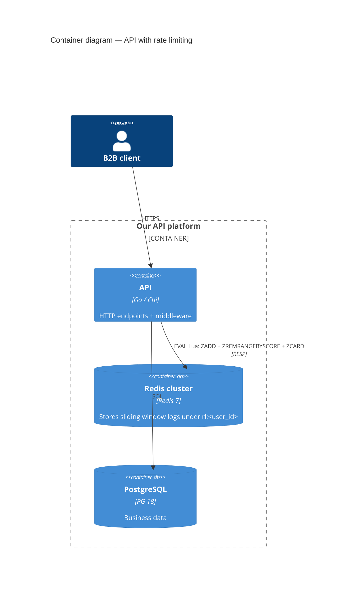

# C4 — Container (Rate limiting)

```mermaid
C4Container
    title Container diagram — API with rate limiting

    Person(user, "B2B client")

    Container_Boundary(sys, "Our API platform") {
        Container(api, "API", "Go / Chi", "HTTP endpoints + middleware")
        ContainerDb(redis, "Redis cluster", "Redis 7", "Stores sliding window logs under rl:<user_id>")
        ContainerDb(pg, "PostgreSQL", "PG 18", "Business data")
    }

    Rel(user, api, "HTTPS")
    Rel(api, redis, "EVAL Lua: ZADD + ZREMRANGEBYSCORE + ZCARD", "RESP")
    Rel(api, pg, "SQL")
```
