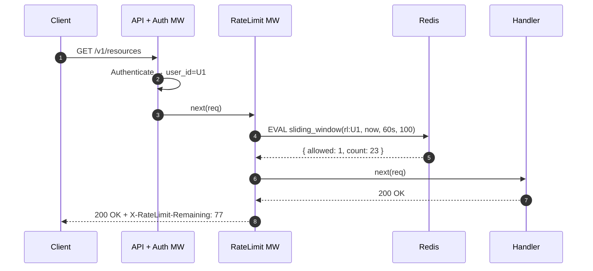
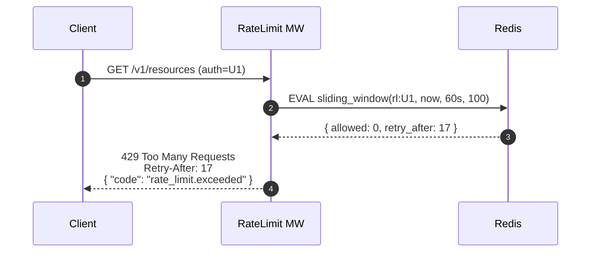
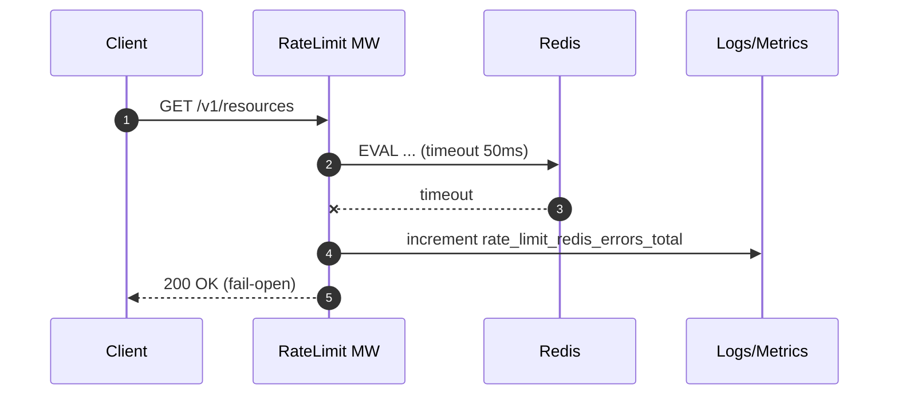

# Sequence — Rate limit decision

## Happy path (request allowed)

```mermaid
sequenceDiagram
    autonumber
    participant C as Client
    participant API as API + Auth MW
    participant RL as RateLimit MW
    participant R as Redis
    participant H as Handler

    C->>API: GET /v1/resources
    API->>API: Authenticate → user_id=U1
    API->>RL: next(req)
    RL->>R: EVAL sliding_window(rl:U1, now, 60s, 100)
    R-->>RL: { allowed: 1, count: 23 }
    RL->>H: next(req)
    H-->>RL: 200 OK
    RL-->>C: 200 OK + X-RateLimit-Remaining: 77
```

## Error path: limit exceeded

```mermaid
sequenceDiagram
    autonumber
    participant C as Client
    participant RL as RateLimit MW
    participant R as Redis

    C->>RL: GET /v1/resources (auth=U1)
    RL->>R: EVAL sliding_window(rl:U1, now, 60s, 100)
    R-->>RL: { allowed: 0, retry_after: 17 }
    RL-->>C: 429 Too Many Requests<br/>Retry-After: 17<br/>{ "code": "rate_limit.exceeded" }
```

## Error path: Redis unavailable (fail-open)

```mermaid
sequenceDiagram
    autonumber
    participant C as Client
    participant RL as RateLimit MW
    participant R as Redis
    participant L as Logs/Metrics

    C->>RL: GET /v1/resources
    RL->>R: EVAL ... (timeout 50ms)
    R--xRL: timeout
    RL->>L: increment rate_limit_redis_errors_total
    RL-->>C: 200 OK (fail-open)
```
