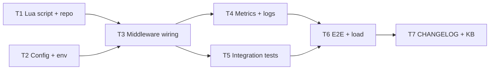

# Task breakdown — Rate limiting

## Dependency graph

## Tasks

| ID | Title | DoR | DoD | Deps | Estimate | Owner |
|----|-------|-----|-----|------|----------|-------|
| T1 | Lua `sliding_window.lua` + Go repo wrapper | PRD AC-01 + ADR-0007 Accepted | EVAL працює, unit tests pass | — | S | Backend Eng |
| T2 | Config: `RATE_LIMIT_RPM`, `RATE_LIMIT_WINDOW_SEC` | PRD §4 NFR | wired у `cmd/api/main.go` | — | XS | Backend Eng |
| T3 | Middleware ordering + handler | T1, T2 done | 429 повертається коректно | T1, T2 | S | Backend Eng |
| T4 | Prometheus metrics + structured logs | T3 | counters incrementуються | T3 | XS | Backend Eng |
| T5 | Integration tests (testcontainers Redis) | T3 | AC-01, AC-02, AC-03 покриті | T3 | S | Backend Eng |
| T6 | E2E + load test (k6, 14k rpm) | T4, T5 | p95 ≤ 5ms middleware overhead | T4, T5 | M | QA + Backend |
| T7 | CHANGELOG + KB note | T6 | tag 0.2.0, KB note merged | T6 | XS | Tech Lead |
